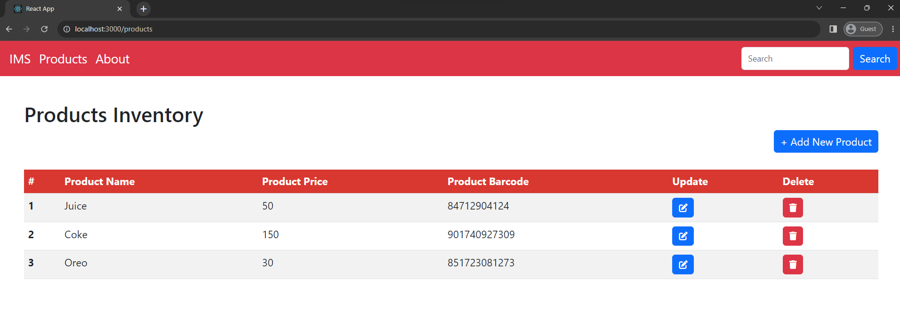
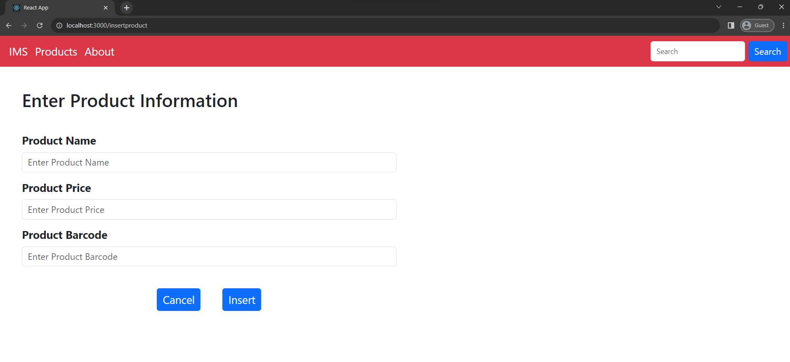
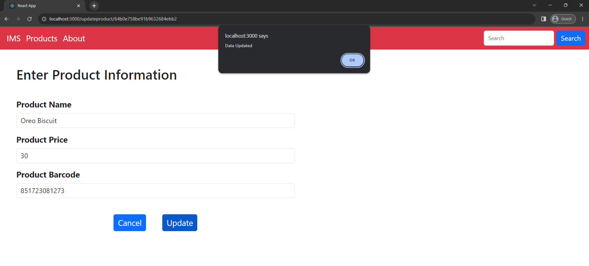
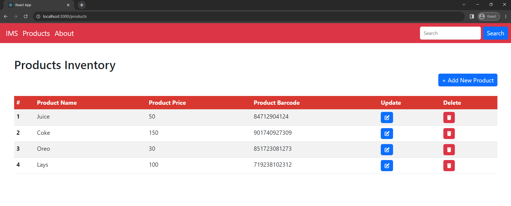
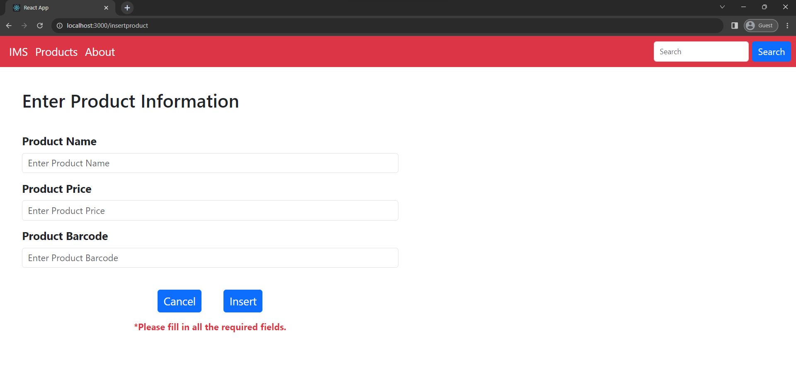

# # 📦 Inventory Management System (MERN CRUD App)

This is a full-stack Inventory Management System web application that I designed and developed from scratch using the **MERN stack**—MongoDB, Express.js, React.js, and Node.js. It allows users to perform Create, Read, Update, and Delete (CRUD) operations on inventory products.

---

## 🚀 Features

* ✅ Add new products with details like name, quantity, and price
* 🔁 Update existing product information
* ❌ Delete products from inventory
* 📋 View and manage all products in a dynamic UI
* 🔍 Search for products by name or barcode
* 🌐 RESTful API integration between frontend and backend
* 💾 Persistent data storage using MongoDB

---

## 🛠️ Tech Stack

- **Frontend**: React.js, Axios, Bootstrap, CSS
- **Backend**: Node.js, Express.js
- **Database**: MongoDB + Mongoose
- **Tools Used**: Postman, MongoDB Compass, dotenv

---

### Start the Backend Server

```bash
cd Backend
npm install
npm run server
```

### Start the Frontend App

```bash
cd Frontend
npm install
npm start
```
## 📸 Screenshots

### 🧾 Product Listing View

| Products Listed | Products Deleted |
|-----------------|------------------|
|  |  |

### ➕ Update Product | ✏️ Update Product

| Update existing product | Update Product |
|------------------|-----------------|
|  |  |

### ➕ Add Product



